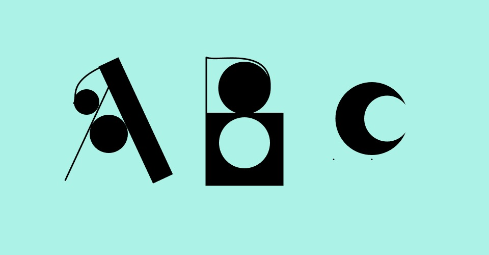
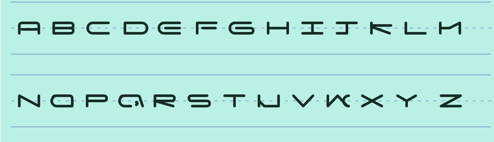
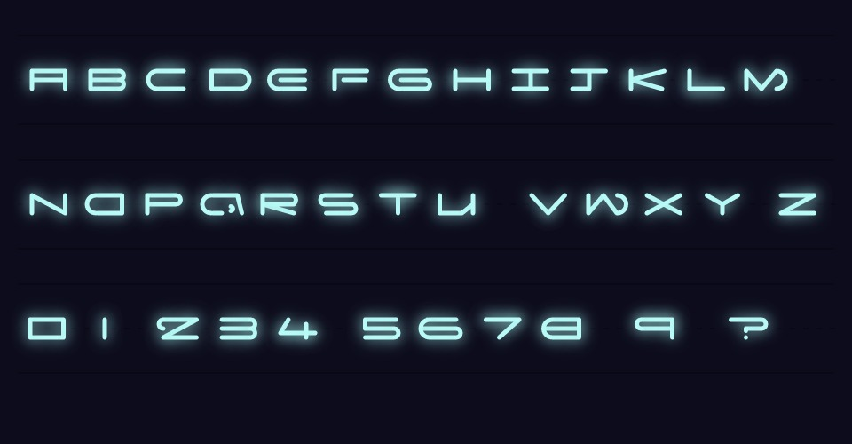
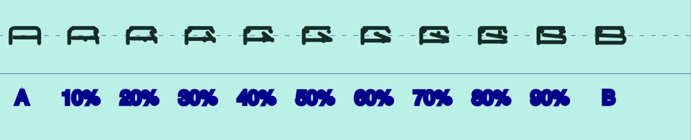
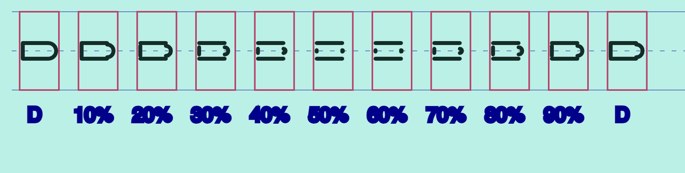

# YEAR3000 by Eri Lovegrove
## MDDN 242 2024 Assignment 2

### Description
YEAR3000 is a font inspired by Y2K futuristic sci-fi styles. It's squat and curved, reminiscent of fonts from the 2000s. However, it also carries a spacey vibe with a glowing effect and blue-on-black color scheme. Imagine it as the kind of font that could have been created during the 2000s for a space-themed design.

Each of my letters is made of:

- two C shaped curves. One is fixed in place vertically while the other can move up and down, as well as change direction. The diameters of these curves can be shrunk to 0. They are utilised in letters like B, D and S.
The parameters that control the curves are:
  * `arcdiameter1` : diameter or arc 1
  * `arcdiameter` : diameter of arc 2
  * `arcdirection` : direction of arc 2 (facing left or facing right)
  * `arc1xposition` : x position of arc 1
  * `arc2xposition` : x position of arc 2
  * `arc2yposition` : y position of arc 2

- 1 vertical line. This line can move vertically and horizontally
The parameters that control this line are:
  * `line4length` : vertical length of the line 
  * `line4yposition` : y position of the line
  * `line4x`: x position of the line

- 1 horizontal line. This line can move vertically and horizontally but can not rotate to be a vertical line. 
The parameters that control this line are:
  * `line1ylength` : y position of the line
  * `line1x` : x position of the line
  * `line1x2` : horizontal length of the line

- 2 versatile lines. These two lines can be diagonal, horizontal or vertical.
The parameters that control the curves are:
  * `line2xposition` : x position of line 2
  * `line2y` : y position of line 2
  * `line2xlength` : horizontal length of line 2
  * `line2ylength` : vertical length of line 2
  * `line3y` : y position of line 3
  * `line3length` : horizontal length of line 3
  * `line3y2` : vertical length of line 3
  * `line1x` : x position of line 3 (also shared by line 1)

- Lastly there is one parameter that translates the whole letter:
  * `translate` 

### Process

When first coming up with ideas I tried using line, circles, rectangels and curves. I found that I went over the maximum amount of parameters. 

I simplified my idea so that I would only be using strokes; simple lines or curves. This was my first iteration, where some letters a still a bit wonky.

I decided to change one of the lines to be more versatile so I could have 2 lines that could act as diagonals. I fixed up letters like K, M, W and U. I changed the colour scheme to convey more of the futuristic style I was going for. I also had to remove a parameter that controlled two small curves for letters like A and 2 image before this one as I thought it looked awful during interpolation. (example below)

(the two small curves/dots at the top of the letter)

My interpolation was also not looking great at the start. Small edits I made was shrinking the two curves down to 0 at 50% during the interpolation so that you wouldn't be able to see the jarring point at which they flip direction. I also made the vertical line shrink in the middle at 50% to add some flair. 

Lastly I added 3 little stars to the exhibition mode as I saw that stars were common in Y2k fonts. 

<!--  -->

